#### 2019-07-29 ( 1일차 )_안드로이드 프로그래밍 1-2주정도

# AndroidStudio

1. 개발툴 = 안드로이드스튜디오 다운로드 & 설치

[안드로이드스튜디오 사이트](https://developer.android.com/studio/?gclid=EAIaIQobChMIv-WBwezY4wIVBdKyCh02twiPEAAYASAAEgIO0vD_BwE)

2. 삼성 usb 드라이버 설치

3. 폰 설정

#### 안드로이드 폰 설정

설정 – 휴대전화 정보 – 소프트웨어정보 (상태,법률정보,,,등등등) – 소프트웨어정보(안드로이드정보,기저대역,빌드번호등등등) -> 빌드번호 선택(탭 7번하면 **개발자모드로 활성화**)하고 세팅에서 개발자 옵션이 새로생김!

개발자 옵션 – 디버깅 -  **usb 디버깅 활성화** 시키기(허용)

다시 설정으로 – 잠금화면 및 보안 - 출처를 알 수 없는 앱 허용으로 바꾸기 

4. Sample Program build, 설치, 실행


#### 안드로이드 스튜디오

세팅 = 폰트 

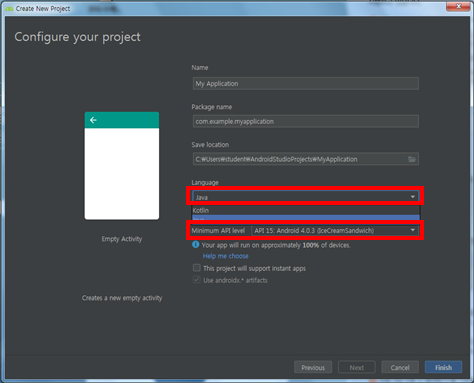

자바언어로 선택 하지만 요즘에는 `kotlin`으로 바뀌는 추세

API는 안드로이드 버전을 의미 – a 부터 z까지 간식이름으로 정해져있음


프로젝트를 만들게 되면 밑에 사진처럼 자동으로 설치됨

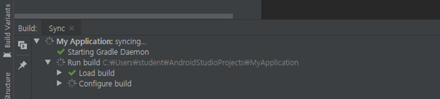

apk파일로 만들어주는 빌드툴 = Gradle

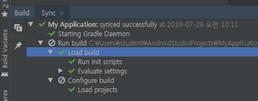

5. 가장 중요하게 생각해야 하는 학습 부분

- Android Component( 4가지 Component )

- Activity

- Service

- Broadcast Receiver

- Content Provider

Android Framework의 동작방식


6. Android

   => Google이 중심이 되서 개발이 진행중인 휴대 단망기용 플랫폼.

   => 운영체제( OS - C언어 ) 

   ​	\+ 미들웨어( C언어, C++ )

   ​	\+ Android Framework( C언어, Java )

   ​	\+ 기본 Application( 주소록, 전화 ) 

   ​	으로 구성된 Software Stack

   

7. Android Version

   1.5 Cupcake

   1.6 Donut

   …

   …

   4.0.1 Ice Cream Sandwitch

   8 OREO

   9 PIE

   10 Q

   

8. 안드로이드 Software Stack

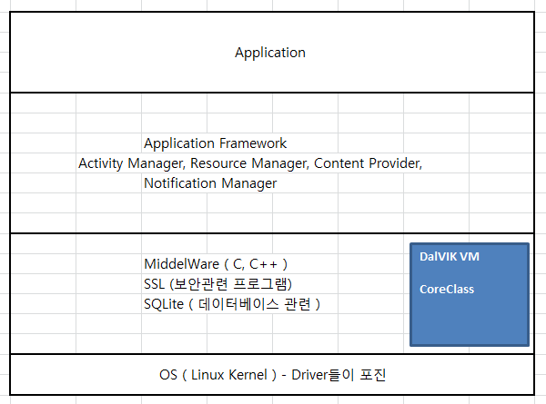

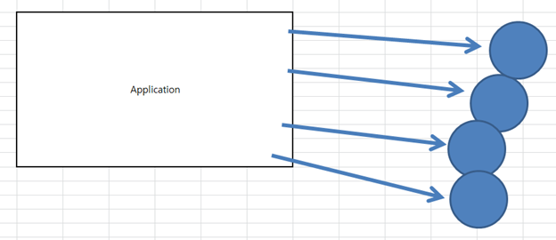

9. Android Component( 4가지 Component )

- Activity

  => 앱을 구성하고 있는 화면 

  ​	 UI ( User Interface )를 ghkauas에 표시하고 관리하는 Component

- Service

  => UI와는 별개로 background로 실행 가능한 Component

- Broadcast Receiver

  => Broadcast : 배터리 부족 통지 

Broadcast Receiver : broadcast를 잡아서 적절한 처리를 담당하는 Component ( 시스템이 보내주는 하드웨어 신호를 보낼 수 있도록 하는)

- Content Provider

  => 안드로이드 앱은 각 앱이 독자적으로 데이터를 관리 ( 다른 앱과 공유할 수 없다. 그래서 Content Provider를 통해 앱간의 데이터 공유를 가능하게 함 ) -> 앱간의 데이터를 공유할 수 있도록 기능을 제공해준다.!!

  

10. Android Project의 구성

    AndroidManifest.xml : application 의 구성과 관련된 설정 정보를 가지고 있는 파일

    MainActivity.java => Activity class

    ​      res : 리소스를 담당하는 폴더

    - drawable : application 내에서 사용되는 그림파일 저장

    - layout : Activity 화면 구성을 위한 XML

    - mipmap : launcher 아이콘 자원을 저장

    - values : 문자열, 색상, 스타일 등 부가적인 리소스들에 대한 정의

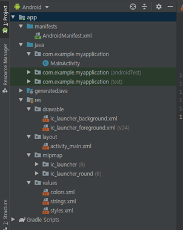

**androidManifest.xml**

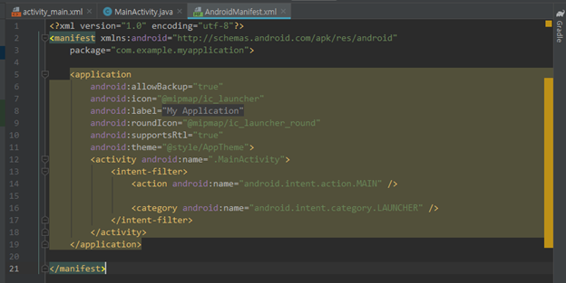

@String은 value에서 string.xml에서 관리하면된다.


**MainActivity.java** : activity_main.xml 를 땡겨와서 사용


**res**폴더 (resource)

- drawable : 이미지 파일들이 들어감 xml형태로 이미지를 표현

- layout : activity의 화면에 들어갈 정보들이 어떻게 위치해 있는지 관리

- mipmap : 아이콘 / 안드로이드에 설치되었을 때 어떤 아이콘을 사용할지 지정

- values : 여러가지 상수 값을 정리해둔 곳 ( color, string, styles )


**MainActivity**에서

11. Logcat의 이용 => System.out.println( )을 사용할 수 없어요!! 

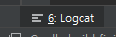

출력은 System.out.println( )이 아닌 Log.i ( 태그, 출력할 메시지 )를 사용한다.

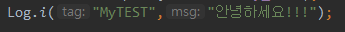

tag,msg자동생성


12. Activity

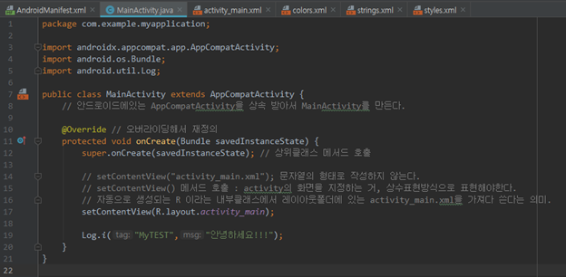


13. View, ViewGroup

    - View : 이미지, 입력상자, 콤보박스, 버튼….등등등 ( View 최상위 클래스 , is a 관계에 의해 )

    - ViewGroup : 레이아웃( layout ) – 5개의 종류가 있다. 

    - View와 ViewGroup( layout )을 이용해서 화면을 구성할 수 있다.!!!

    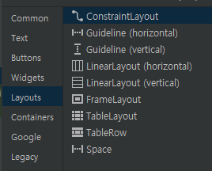

    - ConstraintLayout : 제약사항을 가지고 레이아웃을 잡는다.

**Layout_width, height**

```xml
match_parent : activity 화면에 꽉차게 끔 레이아웃을 잡는다 자기부모의 크기만큼
	wrap_content : 해당 기능의 길이 만큼 화면에 레이아웃을 잡는다. 내가가지고 있는 내용의 크기만큼
```

새로운 레이아웃 xml생성

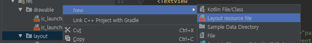

Layout 파일의 이름은 소문자로 해야한다. 대문자 노노

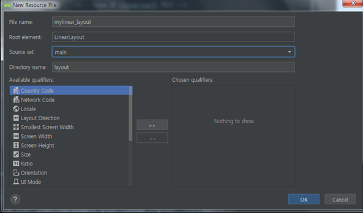


MainActivity에서 변경

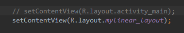

=> 하나의 Activity를 생성하고 내가 원하는 화면을 xml파일을 이용하여 구성할 수 있다.!!! ( 화면구성 )


14. Activity의 life cycle ( 생명주기 )

    Activity의 생명주기

    => 어떤 상태가 존재하며 어떤 method가 callback 되는 지 확인해 보아요!!

    어떤시점에 어떤 메소드가 호출, callback되는지

    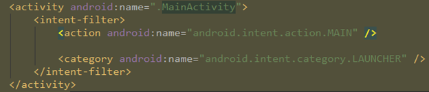

    두개의 actiity가 있을때에 한 개의 activity에 action과 category가 각각 한 개 씩 존재해야한다.

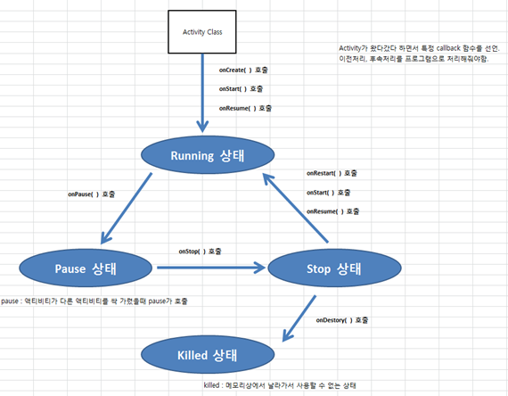

=> Activity의 상태전이와 callback 호출 및 활용

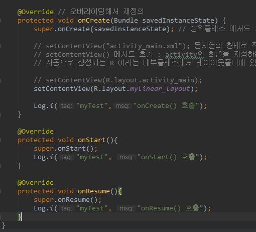

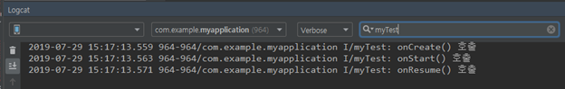

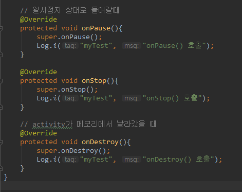

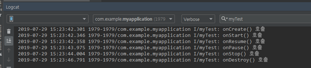

핸드폰에서 왼쪽하단부분 터치하면 onPause(),onStop() 실행됨

onDestory는 history창에서 해당 앱 날리면 뜬다.

