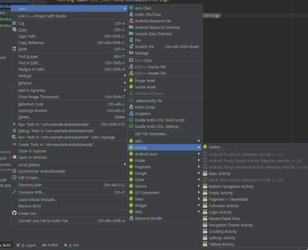

#### 2019-07-30 ( 2일차 )

# AndroidStudio

코드구현으로 실습하면서 수업

이벤트 처리 – imgview ,button을 사용해서 이미지 변경, 토스트메세지 띄우기, dialog, 스와이프처리 등등

새로운 프로젝트 만들기

**AndroidSample**

**Activity_main.xml**

스크롤이 가능하도록 하려면 스크롤뷰가 최상위에 와야한다.

색상은 color.xml에 등록해서 사용하고 위에처럼 불러와서 사용하면된다. 

버튼의 text도 string.xml에 등록해서 사용

아이디는 모두 부여가능

**MainActivity.java**

각 해당하는 버튼에 대한 click이벤트 처리를 해주는 부분 

**activity_main.xml**

**color.xml**

**string.xml**

**Java의 Event 처리**

=> Delegation Model을 이용

1. Event Source : 이벤트가 발생한 객체를 지칭

   자바 초창기에는 Event Source가 직접 Event를 처리

   비효율적인 측면이 있어서 이벤트 처리방식을 변경

   => Delegation Model

   ​	 전문적인 이벤트 처리 객체를 이용해서 이벤트를 처리

2. Event Listener : 이벤트 처리 객체를 지칭

3. Event 객체 : 이벤트에 대한 세부적인 정보를 가지고 있는 객체를 지칭

     				    Event Listener에게 해당객체가 전달

   ​    				  Event Source에 Listener를 부착

**LinearLayout Example**

**LinearLayoutExampleActivity.java**

액티비티가 쌓이는 것 = 액티비티 스텍

**activity_linear_layout_example.xml**

실행결과

**Chatting Activity Example**

**chattingActivity.java**

지역변수들을 해당 클래스의 맴버로 보내준다 => 이러면 메모리 힙영역에서 메모리 많이 차지해서 final을 붙여서 상수로 만들어준다.

Final을 붙여 상수화시켜 메모리에 계속 남겨서 사용한다.

**activity_chatting.xml**

실행결과

**Image 처리 Activity Example**

**ImageActivity.java**

변경 할 이미지는 java에서 선언해준다.

**activity_image.xml**

실행결과 - 버튼 클릭하면 이미지 변경됨!

**Touch Event & Toast Example**

**TouchActivity.java**

**activity_touch.xml**

**Activity Swipe 감지**

