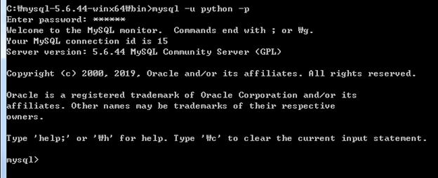

#### 2019-07-31 ( 3일차 )

# AndroidStudio

★  안드로이드에서 UI 에 대한 제어는 Activity 내에서만 사용해야한다.

#### Activity Message 전달

**MessageViewActivity.java**

```java
package com.example.androidsample;

import androidx.appcompat.app.AppCompatActivity;

import android.content.Intent;
import android.os.Bundle;
import android.view.View;
import android.widget.Button;
import android.widget.TextView;

public class MessageViewActivity extends AppCompatActivity {

    @Override
    protected void onCreate(Bundle savedInstanceState) {
        super.onCreate(savedInstanceState);
        setContentView(R.layout.activity_message_viewactivity);

        // dialog에서 입력한데이터 읽어오기
        Intent i = getIntent();
        // key, value 값으로 적은 값들 가져오기
        String msg = (String)i.getExtras().get("sendMsg"); // 여러개니까 복수로, 원래의 형태로 downcasting 해줘야함
        // String msg = i.getExtras().get("sendMsg");

        TextView tv = (TextView)findViewById(R.id.messageTv);
        tv.setText(msg);

        // Activity 종료 버튼
        Button closeBtn = (Button)findViewById(R.id.closeBtn);

        closeBtn.setOnClickListener(new View.OnClickListener() {
            @Override
            public void onClick(View view) {
                finish(); // Activity가 가지는 메서드
            }
        });

    }
}
```

**activity_message_viewactivity.xml**

```xml
<?xml version="1.0" encoding="utf-8"?>
<LinearLayout
    android:layout_width="match_parent"
    android:layout_height="match_parent"
    android:orientation="vertical"
    xmlns:android="http://schemas.android.com/apk/res/android">

    <TextView
        android:layout_width="match_parent"
        android:layout_height="wrap_content"
        android:id="@+id/messageTv"
        android:textSize="15pt"
        android:textAlignment="center"
        android:background="@color/activityBackground"/>

    <Button
        android:layout_width="match_parent"
        android:layout_height="wrap_content"
        android:text="Activity 종료!!"
        android:id="@+id/closeBtn"/>

</LinearLayout>
```


---

#### 다른 Activity로 부터 Data 전달받기

**DataFromActivity.java**

```java
package com.example.androidsample;

import androidx.annotation.Nullable;
import androidx.appcompat.app.AppCompatActivity;

import android.content.Intent;
import android.os.Bundle;
import android.util.Log;
import android.view.View;
import android.widget.AdapterView;
import android.widget.ArrayAdapter;
import android.widget.Button;
import android.widget.Spinner;
import android.widget.Toast;

import java.util.ArrayList;

public class DataFromActivity extends AppCompatActivity {

    private String selectedItem = "";

    @Override
    protected void onCreate(Bundle savedInstanceState) {
        super.onCreate(savedInstanceState);
        setContentView(R.layout.activity_data_from);

        final ArrayList<String> list = new ArrayList<String>();
        list.add("수박");
        list.add("바나나");
        list.add("딸기");
        list.add("멜론");

        Spinner spinner = (Spinner)findViewById(R.id.spinner);

        // adapter가(객체) 필요!! spinner와 ArrayList를 결합시키기위해서
        ArrayAdapter adapter = new ArrayAdapter(getApplicationContext(),
                android.R.layout.simple_spinner_dropdown_item, list);
        // ArrayAdapter("어플리케이션 컨텍스트(this써도됨)","레이아웃어떤형태쓸지","list이용해서")
        //                   getApplicationContext()            스타일             list

        spinner.setAdapter(adapter);

        // spinner에서 item을 선택하는 이벤트 처리가 필요!!
        // setOnItemSelectedListener : 여러개의 아이템중에 하나를 선택했을때 이벤트 처리
        spinner.setOnItemSelectedListener(new AdapterView.OnItemSelectedListener() {
            @Override
            public void onItemSelected(AdapterView<?> adapterView, View view, int i, long l) {
                    selectedItem = (String)list.get(i);
                    Log.i("selectedTest", "선택된 과일 : " + selectedItem);
            }

            @Override
            public void onNothingSelected(AdapterView<?> adapterView) {

            }
        });

        // 버튼 클릭 이벤트 처리
        Button sendMsgBtn = (Button)findViewById(R.id.sendMsgBtn);

        sendMsgBtn.setOnClickListener(new View.OnClickListener() {
            @Override
            public void onClick(View view) {
                // 기존의 코드와 틀려짐
                // => 클릭되면 현재 선택한 과일이름을 이전 Activity로 전달하고 현재 Activity는 종료
                Intent resultIntent = new Intent();
                resultIntent.putExtra("DATA", selectedItem); // key: data, value:과일이름

                setResult(5000, resultIntent);
                // (액티비티의 결과값 설정 , 결과값으로 돌려줄것)
                // 현재 액티비티가 종료되면 자동으로 전달됨
                DataFromActivity.this.finish();  // finish(); 와 같은 의미
                // this만쓰면 리스너를 의미할수 있어서 앞에 Activity를 명시해준다.


            }
        });

    }

}
```

**activity_data_from.xml**

```xml
<?xml version="1.0" encoding="utf-8"?>
<LinearLayout
    android:layout_width="match_parent"
    android:layout_height="match_parent"
    android:orientation="vertical"
    xmlns:android="http://schemas.android.com/apk/res/android">


    <!-- Spinner :  데이터는 자바코드에서 -->
    <Spinner
        android:layout_width="match_parent"
        android:layout_height="wrap_content"
        android:id="@+id/spinner" />

    <Button
        android:layout_width="match_parent"
        android:layout_height="wrap_content"
        android:text="이전 Activity로 데이터 전송!!!"
        android:id="@+id/sendMsgBtn"/>

</LinearLayout>
```


---

#### ANR (Application Not Responding )

**ANRActivity.java**

```java
package com.example.androidsample;

import androidx.appcompat.app.AppCompatActivity;

import android.os.Bundle;
import android.view.View;
import android.widget.Button;
import android.widget.TextView;
import android.widget.Toast;

//thread 객체를 만들기 위한 class
// 직접 thread 클래스 상속받는 경우 => 잘안씀
/*class MySum extends Thread{

}*/
// 특정 인터페이스를 구현해서 class 생성
class MySum implements Runnable {

    private TextView tv;

    MySum(TextView tv){ // 인젝션 : 클래스간의 연결구조와 상관없이 유연하게 사용가능
                        // 한 객체를 다른 객체에서 넣어서 사용할수 있는
        this.tv = tv;
    }

    // run이라는 추상메서드를 가지고 있기때문에 오버라이딩 해줘야함

    @Override
    public void run() {
        // Thread가 실행이 되면 수행되는 코드를 여기에 작성
        long sum = 0;
        for(long i =0; i<1000000000L; i++){
            sum += i;
        }
        tv.setText("총합은 : " + sum);

    }
}

// ★ 안드로이드에서 UI 에 대한 제어는 Activity 내에서만 즉 mainThread에서만 사용이 가능하다.
//    외부에서 하면 안됨!!

// MainThread
public class ANRActivity extends AppCompatActivity {

    @Override
    protected void onCreate(Bundle savedInstanceState) {
        super.onCreate(savedInstanceState);
        setContentView(R.layout.activity_anr);

        final TextView tv = (TextView)findViewById(R.id.countTv);
        Button countBtn = (Button)findViewById(R.id.countBtn);
        Button toastBtn = (Button)findViewById(R.id.toastBtn);

        countBtn.setOnClickListener(new View.OnClickListener() {
            @Override
            public void onClick(View view) {

                // Thread를 파생시켜야해요!! => 외부클래스를 만들어서 (위에 만듬)
                MySum mySum = new MySum(tv); // Runnable interface를 구현한 객체일뿐 , MySum(객체를 넣어줘야함)

                // Thread를 생성
                Thread t = new Thread();

                t.start(); // non-blocking method : 멈춰있는 메서드가 아니라 수행과 상관없이 계속 진행됨
                           // 새로운 실행흐름을 만들어 낼 수 있어요!!!

                //=> 이렇게 처리는 했는데 UI는 처리가 안된다.
                // tv.setText("총합은 : " + sum);
            }
        });

        toastBtn.setOnClickListener(new View.OnClickListener() {
            @Override
            public void onClick(View view) {
                Toast.makeText(ANRActivity.this,"Toast가 실행되요!!", Toast.LENGTH_SHORT).show();
            }
        });
    }
}
```

**activity_anr.xml**

```xml
<?xml version="1.0" encoding="utf-8"?>
<LinearLayout
    android:layout_width="match_parent"
    android:layout_height="match_parent"
    android:orientation="vertical"
    android:background="@color/activityBackground"
    xmlns:android="http://schemas.android.com/apk/res/android" >

    <TextView
        android:layout_width="match_parent"
        android:layout_height="wrap_content"
        android:id="@+id/countTv"
        android:textSize="15pt"
        android:textAlignment="center"/>

    <Button
        android:layout_width="match_parent"
        android:layout_height="wrap_content"
        android:text="연산 시작!!"
        android:id="@+id/countBtn"/>

    <Button
        android:layout_width="match_parent"
        android:layout_height="wrap_content"
        android:text="Toast 실행!!"
        android:id="@+id/toastBtn"/>

</LinearLayout>
```


---

#### Counter App (실행에러)

**NoCounterActivity.java**

```java
package com.example.androidsample;

import androidx.appcompat.app.AppCompatActivity;

import android.os.Bundle;
import android.view.View;
import android.widget.Button;
import android.widget.TextView;

class MyCounter implements Runnable{

    private TextView tv;

    MyCounter(TextView tv){
        this.tv = tv;
    }

    @Override
    public void run() {
        // 1초마다 카운트를 증가시켜서 TextView에 출력
        for (int i = 0; i<10; i++){
            try {
                Thread.sleep(1000); // 1초 머무름 , sleep에러 => try-catch사용
                 tv.setText("count : "+ i);
                // UI Thread에 message를 보낸다!!
            } catch (Exception e){

            }
        }
    }
}

public class NoCounterActivity extends AppCompatActivity {

    @Override
    protected void onCreate(Bundle savedInstanceState) {
        super.onCreate(savedInstanceState);
        setContentView(R.layout.activity_no_counter);

        final TextView tv = (TextView)findViewById(R.id.counterTv);
        Button startBtn = findViewById(R.id.startBtn);

        startBtn.setOnClickListener(new View.OnClickListener() {
            @Override
            public void onClick(View view) {
                // Thread 하나 생성해서 1초마다 TextView에 카운트를 출력
               /* Thread t = new Thread(new Runnable() {
                    @Override
                        public void run() {
                        // 1초마다 카운트를 증가시켜서 TextView에 출력
                        for (int i = 0; i<10; i++){
                        try {
                              Thread.sleep(1000); // 1초 머무름 , sleep에러 => try-catch사용
                              tv.setText("count : "+ i);

                        } catch (Exception e){
                        }
                    }
                }
            });*/

               MyCounter counter = new MyCounter(tv);
               Thread t =  new Thread(counter);
               t.start(); // thread 시작
            }
        });
    }
}
```

**activity_no_counter.xml**

```xml
<?xml version="1.0" encoding="utf-8"?>
<LinearLayout
    android:layout_width="match_parent"
    android:layout_height="match_parent"
    android:orientation="vertical"
    android:background="@color/activityBackground"
    xmlns:android="http://schemas.android.com/apk/res/android" >

    <TextView
        android:layout_width="match_parent"
        android:layout_height="wrap_content"
        android:textSize="15pt"
        android:textAlignment="center"
        android:id="@+id/counterTv"/>

    <Button
        android:layout_width="match_parent"
        android:layout_height="wrap_content"
        android:text="카운터 시작!!"
        android:id="@+id/startBtn"/>

</LinearLayout>
```


---

#### Counter App (Handler)

**CounterActivity.java**

```java
package com.example.androidsample;

import androidx.annotation.NonNull;
import androidx.appcompat.app.AppCompatActivity;

import android.os.Bundle;
import android.os.Handler;
import android.os.Message;
import android.view.View;
import android.widget.Button;
import android.widget.TextView;

class MyCounter1 implements Runnable{

    // thread에서는 handler를 받아 인젝션시키고 필드에 설정을 잡아줘야함
    private Handler handler;

    MyCounter1(Handler handler){
        this.handler = handler;
    }

    @Override
    public void run() {
        // 1초마다 카운트를 증가시켜서 TextView에 출력
        for (int i = 0; i<10; i++){
            try {
                Thread.sleep(1000); // 1초 머무름 , sleep에러 => try-catch사용
                // Bundle : 데이터를 묶을 수 있는 단위
                Bundle bundle = new Bundle();
                bundle.putString("COUNT", i + ""); // key와 value 쌍으로 받음, ""문자열변환

                Message msg = new Message();
                msg.setData(bundle);
                handler.sendMessage(msg);

                // UI Thread에 message를 전달!! => activity counter가 받음

            } catch (Exception e){

            }
        }
    }
}

public class CounterActivity extends AppCompatActivity {

    @Override
    protected void onCreate(Bundle savedInstanceState) {
        super.onCreate(savedInstanceState);
        setContentView(R.layout.activity_counter);

        final TextView tv1 = (TextView)findViewById(R.id.counterTv1);
        Button startBtn1 = (Button)findViewById(R.id.startBtn1);

        // Handler : 중간 매개체, 핸들러를 이용해서 메세지 전달.
        final Handler handler = new Handler() {
            // message를 받는 순간 아래 method가 호출 된다.

            @Override
            public void handleMessage(@NonNull Message msg) {
                super.handleMessage(msg);
                Bundle b = msg.getData();
                tv1.setText(b.getString("COUNT")); // key값을 받아와 text로로
           }
        };

        startBtn1.setOnClickListener(new View.OnClickListener() {
            @Override
            public void onClick(View view) {
                // Thread 하나 생성해서 1초마다 TextView에 카운트를 출력
                MyCounter1 counter = new MyCounter1(handler); // thread에서는 handler를 받아 인젝션시키고 필드에 설정을 잡아줘야함
                Thread t =  new Thread(counter);
                t.start(); // thread 시작
            }
        });
    }
}
```

**activity_counter.xml**

```xml
<?xml version="1.0" encoding="utf-8"?>
<LinearLayout
    android:layout_width="match_parent"
    android:layout_height="match_parent"
    android:orientation="vertical"
    android:background="@color/activityBackground"
    xmlns:android="http://schemas.android.com/apk/res/android" >

    <TextView
        android:layout_width="match_parent"
        android:layout_height="wrap_content"
        android:textSize="15pt"
        android:textAlignment="center"
        android:id="@+id/counterTv1"/>

    <Button
        android:layout_width="match_parent"
        android:layout_height="wrap_content"
        android:text="카운터 시작!!"
        android:id="@+id/startBtn1"/>

</LinearLayout>
```


---

#### **실습해보기**

1. MySQL Database Setting ( 도서정보 )

   => 제공된 Script file을 이용해서 Database 세팅 ( O )

2. Java Servlet으로 Database Access program 작성

   => 입력 : 책 제목의 keyword

   => 출력 : 책 제목 리스트 ( JSON )

3. Android에서 Java Network 기능 중 HTTP request 호출기능을 이용하여 Servlet 호출 후 JSON 받기

4. JSON 형태로 데이터를 받아온 후 데이터를 받아온 후 parsing 해서 ListView에 출력


일단 MySQL이 안깔려있어서 설정 다하고 

\> mysql –u python –p 




mysql> show databases;


