#### 2019-08-01 ( 4일차 )

# AndroidStudio

## Android_BookSearch

1. MySQL Database Setting ( 도서정보 )

   => 제공된 Script file을 이용해서 Database 세팅 ( O )

   ​	  Database : 데이터의 집합체

   ​	  DBMS( DataBase Management System ) : Database를 관리, 사용하기 위한 software의 집합

   ​	=> Oracle, DB2, informix, Sybase, MySQL, ….

   => 초창기( 계층형 데이터베이스 : 상위카테고리에서 하위카테고리로 관리 ex) 폴더관리 )

   ​     관리하기는 쉬운데 사용하기는 어려움.

   ​	=> 네트워크 데이터베이스 등장( 계층형 데이터베이스 단점 극복, 이론적인 측면은 좋았지만 실제 사용되는 경우는 거의 없었다. )

   ​		 수학자가 논문을 하나 발표함….

   ​	=> 관계형 데이터 => 데이터를 테이블 형태로 저장. => 관계해석, 관계대수

   ​	=> IBM 이 해당 논문을 근간으로 DBMS를 구축 

   ​		=>DB2의 시초가 되는 DBMS가 탄생

   ​		=> 이걸 시작으로 모든 DBMS는 관계형 DBMS로 전환.

   ​		=> 1990년대 후반까지 잘 사용하다가 객체지향 패러다임이 시작.

   ​		=> DB 쪽에서는 프로그램언어와는 다르게 객체지향의 중요한 특성만을 받아들여서 객체 - 관계형 데이터베이스로 발전을 시킨다

   ​		=> 빅데이터(비정형) 시대로 접어들고 있다. ( 3V ? ,속도, 데이터의 다양성)

   ​			 비정형 데이터를 저장, 관리할때는 관계형 데이터베이스는 효율적이지 않다.

   ​			 그래서 No SQL 계열의 DB가 사용되기 시작. ( 몽고DB )

#### 설치

- MySQL DBMS 기동

  C:\Users\student\Desktop\Android_BookSearch\MySQL\MySQL 5.6\mysql-5.6.45-winx64\mysql-5.6.45-winx64\bin 에서 DBMS를 기동시킨다.

  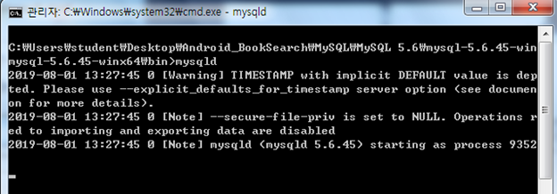

  커서가 깜빡깜빡 거림 / 서버프로그램이 돌아가고 있는거임.. minimize

​		\>> mysqld

​		기본적으로 포트번호 3306을 사용

- MySQL daemon process가 실행이 되면 MySQL에 접속을 할 수 있다.

  우리는 MySQL console ( cmd )에 root 사용자로 접속

​		\>> mysql –u root

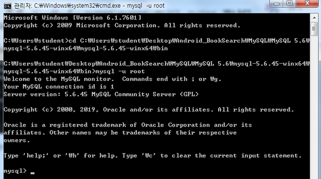

- MySQL에 접속한 후 사용자 생성부터 시작 – 계정 2개 만듬

  mysql> create user android identified by “android”;

  사용자를 주가적으로 만들어줘야함 : 외부에서 사용할 수 있게끔

  mysql> create user android@localhost identified by “android”;

  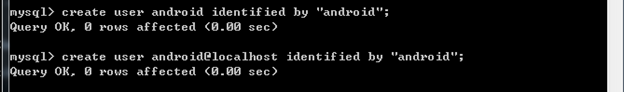

- MySQL DBMS안에 여러 개의 Database를 생성하고 관리 할 수 있다.

  우리가 사용할 database를 생성.

  mysql> create database library;

  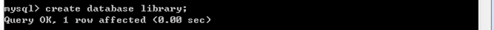

- 3번 단계에서 만든 새로운 사용자(android)에게 Database(library) 사용 권한을 부여.

  mysql> grant all privileges on library.* to android;   // *(모든)

  mysql> grant all privileges on library.* to android@localhost;

  

- 권한 flush // 권한 reloading하는 것

  mysql> flush privileges;

  

- MySQL console 종료

  mysql> exit;

  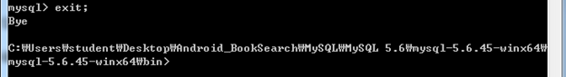

- 사용할 데이터를 Database에 구축하는 작업을 진행 => 관계형 데이터이기 때문에 테이블의 형태로 

  제공된 Script file을 이용해서 데이터 구축을 진행

  \> mysql –u android –p library < _BookTableDump.sql

  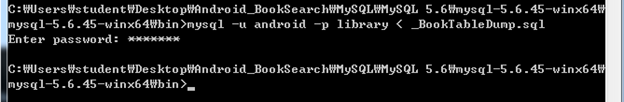

  

#### Transaction

사용자가 임의로 정해주는 거 / 물리적인 개념이 아닌 **논리적인 개념**

**정의** : 작업(일)의 최소 단위

​		  특정한 단위작업의 묶음을 Transaction으로 설정할 수 있다! CRUD

예 ) 은행의 이체업무는 Transaction으로 설정할 수 있어요!

   A라는 사람의 계좌에서 B라는 사람의 계좌로 2000원을 이체

1. A라는 사람의 계좌에 돈이 충분한지 selection

2. A라는 사람의 계좌에서 2000원을 빼요. ( update )

3. B라는 사람의 계좌에서 잔액을 알아내요. ( selection )

4. 알아낸 잔액 + 2000원 한 금액을 저장해요. ( update )

그러면 왜 **Transaction을 설정**할까요? 

**★DBMS에서 ACID라고 불리는 기능을 제공받기 위해서 설정★**

- **A**tomicity ( 원자성 ) : Transaction으로 지정된 작업은 모두 성공하거나 하나도 하지 않은 상태로 관리되어야 한다.

- **C**onsistency ( 일치성 ) : Transaction이 종료된 후에 데이터의 일관성이 유지되어야 한다. – 데이터베이스가 보장해준다.

- **I**solation ( 독립성 ) : Transaction이 걸려있는 resource에 대해서 Transaction이 종료될 때까지 데이터에 대한 접근을 제한한다.

- **D**urability ( 영속성 ) : Transaction의 처리결과는 2차 저장소에 안전하게 저장되는 것을 보장하는 기능.

**★** 반드시 데이터베이스를 할 때는 Transaction을 잡고서 해야 한다.!! 프로그램에서 Transaction을 어떻게 사용하고 어떻게 관리 하는지 알아야 한다.

---

2. Java Servlet으로 Database Access program 작성

   => 입력 : 책 제목의 keyword – 문자열

   => 출력 : 책 제목 리스트 ( JSON ) - arraylist

이클립스 BookSearch_Workspace 프로젝트 생성 

- Eclipse의 설정부터 잡는다.

​	=> Encoding 설정

​		 Workspace에 대한 text file encoding => UTF-8

- Tomcat WAS를 Eclipse와 연동

​	=> 클라이언트 ( Web Browser ) 가 Tomcat을 통해서 서버프로그램을 호출할 때 데이터를 전달할 수 있다.

​		기본적으로 이 데이터 연결 통로가 ISO9958_1이라는 영문 encoding으로 되어있다!!

​		한글이 전달될 경우 문제가 발생 => UTF-8로 해당 데이터 연결통로의 Encoding을 변경

​		server.xml 파일을 수정해서 처리

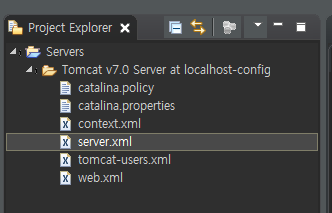

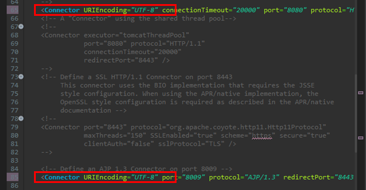

- Dynamic Web Project 생성

  Project name : BookSearchForAndroid

  Context root : bookSearch

  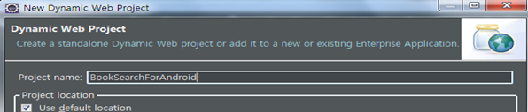

  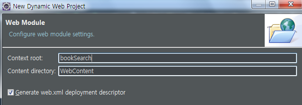

  => 프로젝트가 생성

  => MVC pattern으로 파일을 생성

  ​	 클라이언트의 입력을 받고 출력을 내보내는 작업

  ​	 Servlet이 담당 => controller

  ​	 Business logic을 담당 => service

  ​	 database관련작업을 담당 => DAO ( data access object )

  ​	 데이터 전달에 대한 객체 => DTO ( Data Transfer Object )

  ​													= VO ( Value Object ), DO ( Domain Object ), Entity

​		Sevlet을 생성

​		=> url mapping 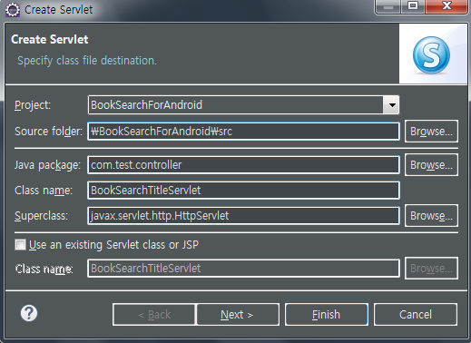

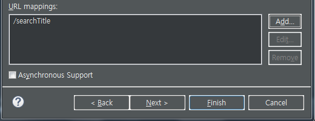

get방식으로 사용할 꺼임

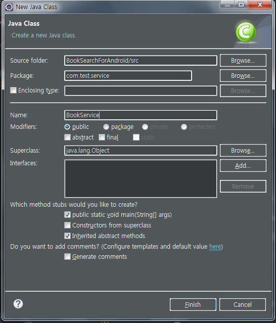

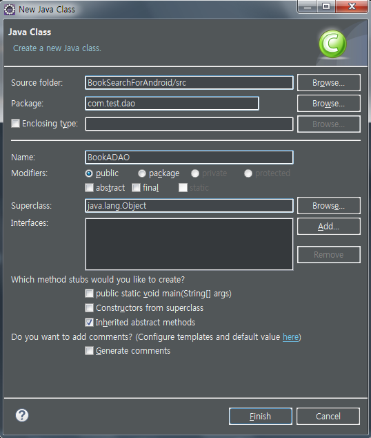

http://localhost:8080/bookSearch/searchTitle?keyword=java

http://localhost:8080/bookSearch/searchTitle?USER_KEYWORD=java

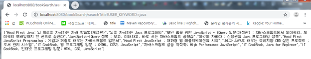

---

3. Android에서 Java Network 기능 중 HTTP request 호출기능을 이용하여 Servlet 호출 후 JSON 받기

---

4. JSON 형태로 데이터를 받아온 후 데이터를 받아온 후 parsing 해서 ListView에 출력