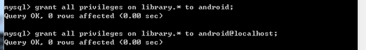

#### 2019-08-01 ( 4일차 )

# AndroidStudio

## 실습해보기 - 도서제목검색 및 출력

### Android_BookSearch

1. MySQL Database Setting ( 도서정보 )

   => 제공된 Script file을 이용해서 Database 세팅 ( O )

   ​	  Database : 데이터의 집합체

   ​	  DBMS( DataBase Management System ) : Database를 관리, 사용하기 위한 software의 집합

   ​	=> Oracle, DB2, informix, Sybase, MySQL, ….

   => 초창기( 계층형 데이터베이스 : 상위카테고리에서 하위카테고리로 관리 ex) 폴더관리 )

   ​     관리하기는 쉬운데 사용하기는 어려움.

   ​	=> 네트워크 데이터베이스 등장( 계층형 데이터베이스 단점 극복, 이론적인 측면은 좋았지만 실제 사용되는 경우는 거의 없었다. )

   ​		 수학자가 논문을 하나 발표함….

   ​	=> 관계형 데이터 => 데이터를 테이블 형태로 저장. => 관계해석, 관계대수

   ​	=> IBM 이 해당 논문을 근간으로 DBMS를 구축 

   ​		=>DB2의 시초가 되는 DBMS가 탄생

   ​		=> 이걸 시작으로 모든 DBMS는 관계형 DBMS로 전환.

   ​		=> 1990년대 후반까지 잘 사용하다가 객체지향 패러다임이 시작.

   ​		=> DB 쪽에서는 프로그램언어와는 다르게 객체지향의 중요한 특성만을 받아들여서 객체 - 관계형 데이터베이스로 발전을 시킨다

   ​		=> 빅데이터(비정형) 시대로 접어들고 있다. ( 3V ? ,속도, 데이터의 다양성)

   ​			 비정형 데이터를 저장, 관리할때는 관계형 데이터베이스는 효율적이지 않다.

   ​			 그래서 No SQL 계열의 DB가 사용되기 시작. ( 몽고DB )


#### 설치

- MySQL DBMS 기동

  C:\Users\student\Desktop\Android_BookSearch\MySQL\MySQL 5.6\mysql-5.6.45-winx64\mysql-5.6.45-winx64\bin 에서 DBMS를 기동시킨다.

  

  커서가 깜빡깜빡 거림 / 서버프로그램이 돌아가고 있는거임.. minimize

​		\>> mysqld

​		기본적으로 포트번호 3306을 사용

- MySQL daemon process가 실행이 되면 MySQL에 접속을 할 수 있다.

  우리는 MySQL console ( cmd )에 root 사용자로 접속

​		\>> mysql –u root


- MySQL에 접속한 후 사용자 생성부터 시작 – 계정 2개 만듬

  mysql> create user android identified by “android”;

  사용자를 주가적으로 만들어줘야함 : 외부에서 사용할 수 있게끔

  mysql> create user android@localhost identified by “android”;

  

- MySQL DBMS안에 여러 개의 Database를 생성하고 관리 할 수 있다.

  우리가 사용할 database를 생성.

  mysql> create database library;

  

- 3번 단계에서 만든 새로운 사용자(android)에게 Database(library) 사용 권한을 부여.

  mysql> grant all privileges on library.* to android;   // *(모든)

  mysql> grant all privileges on library.* to android@localhost;

  

- 권한 flush // 권한 reloading하는 것

  mysql> flush privileges;

  

- MySQL console 종료

  mysql> exit;

  

- 사용할 데이터를 Database에 구축하는 작업을 진행 => 관계형 데이터이기 때문에 테이블의 형태로 

  제공된 Script file을 이용해서 데이터 구축을 진행

  \> mysql –u android –p library < _BookTableDump.sql

  

  

#### Transaction

사용자가 임의로 정해주는 거 / 물리적인 개념이 아닌 **논리적인 개념**

**정의** : 작업(일)의 최소 단위

​		  특정한 단위작업의 묶음을 Transaction으로 설정할 수 있다! CRUD

예 ) 은행의 이체업무는 Transaction으로 설정할 수 있어요!

   A라는 사람의 계좌에서 B라는 사람의 계좌로 2000원을 이체

1. A라는 사람의 계좌에 돈이 충분한지 selection

2. A라는 사람의 계좌에서 2000원을 빼요. ( update )

3. B라는 사람의 계좌에서 잔액을 알아내요. ( selection )

4. 알아낸 잔액 + 2000원 한 금액을 저장해요. ( update )

그러면 왜 **Transaction을 설정**할까요? 

**★DBMS에서 ACID라고 불리는 기능을 제공받기 위해서 설정★**

- **A**tomicity ( 원자성 ) : Transaction으로 지정된 작업은 모두 성공하거나 하나도 하지 않은 상태로 관리되어야 한다.

- **C**onsistency ( 일치성 ) : Transaction이 종료된 후에 데이터의 일관성이 유지되어야 한다. – 데이터베이스가 보장해준다.

- **I**solation ( 독립성 ) : Transaction이 걸려있는 resource에 대해서 Transaction이 종료될 때까지 데이터에 대한 접근을 제한한다.

- **D**urability ( 영속성 ) : Transaction의 처리결과는 2차 저장소에 안전하게 저장되는 것을 보장하는 기능.

**★** 반드시 데이터베이스를 할 때는 Transaction을 잡고서 해야 한다.!! 프로그램에서 Transaction을 어떻게 사용하고 어떻게 관리 하는지 알아야 한다.


---

2. Java Servlet으로 Database Access program 작성

   => 입력 : 책 제목의 keyword – 문자열

   => 출력 : 책 제목 리스트 ( JSON ) - arraylist

**이클립스** BookSearch_Workspace 프로젝트 생성 


- Eclipse의 설정부터 잡는다.

​	=> Encoding 설정

​		 Workspace에 대한 text file encoding => UTF-8

- Tomcat WAS를 Eclipse와 연동

​	=> 클라이언트 ( Web Browser ) 가 Tomcat을 통해서 서버프로그램을 호출할 때 데이터를 전달할 수 있다.

​		기본적으로 이 데이터 연결 통로가 ISO9958_1이라는 영문 encoding으로 되어있다!!

​		한글이 전달될 경우 문제가 발생 => UTF-8로 해당 데이터 연결통로의 Encoding을 변경

​		server.xml 파일을 수정해서 처리


- Dynamic Web Project 생성

  Project name : BookSearchForAndroid

  Context root : bookSearch

  

  

  => 프로젝트가 생성

  => MVC pattern으로 파일을 생성

  ​	 클라이언트의 입력을 받고 출력을 내보내는 작업

  ​	 Servlet이 담당 => controller

  ​	 Business logic을 담당 => service

  ​	 database관련작업을 담당 => DAO ( data access object )

  ​	 데이터 전달에 대한 객체 => DTO ( Data Transfer Object )

  ​													= VO ( Value Object ), DO ( Domain Object ), Entity


​		Sevlet을 생성

​		=> url mapping 


get방식으로 사용할 꺼임


**BookSearchTitleServlet.java**

```java
package com.test.controller;

import java.io.IOException;
import java.io.PrintWriter;
import java.util.List;

import javax.servlet.ServletException;
import javax.servlet.annotation.WebServlet;
import javax.servlet.http.HttpServlet;
import javax.servlet.http.HttpServletRequest;
import javax.servlet.http.HttpServletResponse;

import com.fasterxml.jackson.databind.ObjectMapper;
import com.test.service.BookService;


@WebServlet("/searchTitle")
public class BookSearchTitleServlet extends HttpServlet {
	private static final long serialVersionUID = 1L;
       
    
    public BookSearchTitleServlet() {
        super();
    }

	protected void doGet(HttpServletRequest request, HttpServletResponse response) throws ServletException, IOException {
		// 입력받고 
		String keyword = request.getParameter("USER_KEYWORD"); 
		//String keyword = request.getParameter("keyword");
		// 로직처리를 Service에게 위임
		// Service를 생성해서 Service에게 일을 시킨 후 결과를 받아와요!!  
		// 객체만들어주기
		BookService service = new BookService(); 
		// 서비스가 가지고 있는 메서드 호출
		List<String> list = service.getBooksTitle(keyword); //키워드를 줘야함, 메서드 이름은 transaction으로 잡아줘야함
		// String 이 아닌 list로 받는다
		
		// 출력처리(JSON)
		response.setContentType("text/plain; charset=UTF8");
		PrintWriter out = response.getWriter();
		
		ObjectMapper mapper = new ObjectMapper();
		String json = mapper.writeValueAsString(list);
		
		out.print(json);
		//out.print("list에 JSON 문자열을 보내요!!!");
		// JSON 간단하게 만드는거 JACKSON Library 사용
		out.flush();
		out.close();
	}

	protected void doPost(HttpServletRequest request, HttpServletResponse response) throws ServletException, IOException {
		doGet(request, response);
	}

}
```


**BookService.java**

```java
package com.test.service;

import java.sql.Connection;
import java.util.List;
import com.test.dao.BookDAO;
import com.test.dto.BookVO;

// Service 객체를 만들기 위한 class
public class BookService {

	// Business Logic(Transaction)에 대한 method만 나와요!
	// 하나의 Transaction(기능)당 1개의 method가 이용.
	public List<String> getBooksTitle(String keyword) {
		/*
		 * // 로직처리(더하기, 뺴기, for, if, etc...) // 로직처리 코드가 많이 나와요!!! // Database 처리가 나와야
		 * 해요!! // DAO를 만들어서 database처리를 한 후 결과를 가져와요!! BookDAO dao = new BookDAO(); //
		 * CRUD를 다루는 List<String> list = dao.selectTitle(keyword); return list;
		 */
		Connection con = null;
		List<String> list = null;
		try {
			con = common.DBTemplate.getConnection();
			// con 객페에 대한 transaction이 시작
			BookDAO dao = new BookDAO(con); // 데이터베이스를 처리할때 BookDAO한데 con을 넘겨줌 => 인젝션
			list = dao.selectTitle(keyword);
			
			// 얻어온 결과를 이요해서 transaction의 commit과 rollback을 판단
			if(list != null) {
				// transaction 이 정상적으로 처리 되었을 경우
				con.commit();
			}else {
				// transaction 처리에 오류가 있는 경우
				con.rollback();
			}
						
			}catch (Exception e) {
				System.out.println(e);
					
			} finally {
				try {
						
				// close작업을 해줘야함 close할때도 Exception이 발생할수 있기때문에 try-catch 사용해야함
				con.close();
							
			} catch (Exception e1) {
				System.out.println(e1);
			}
								
		}
		
		return list;
		
	}
	
	

	public List<BookVO> getBooks(String keyword) {
		// 로직처리(DB처리를 포함해서)
		// Transaction : 작업의 최소 단위
		// 데이터베이스 connection에대한 코드를 여기에 적어준다. 
		// DAO가 아닌 => Transation을 처리하기위해서는 Service에서 정의해주는 게 맞다.
		
		Connection con = null;
		List<BookVO> list = null;
		
		try {
			con = common.DBTemplate.getConnection();
			// con 객페에 대한 transaction이 시작
			BookDAO dao = new BookDAO(con); // 데이터베이스를 처리할때 BookDAO한데 con을 넘겨줌 => 인젝션
			list = dao.select(keyword);
			
			// 얻어온 결과를 이요해서 transaction의 commit과 rollback을 판단
			if(list != null) {
				// transaction 이 정상적으로 처리 되었을 경우
				con.commit();
			}else {
				// transaction 처리에 오류가 있는 경우
				con.rollback();
			}
			
		}catch (Exception e) {
			System.out.println(e);
		
		} finally {
			try {
				
				// close작업을 해줘야함 close할때도 Exception이 발생할수 있기때문에 try-catch 사용해야함
				con.close();
				
			} catch (Exception e1) {
				System.out.println(e1);
			}
			
				
		}
		
		/*
		 * // DB처리 첫번째 dao.firstMethod();
		 * 
		 * // DB처리 두번째 dao.secondMethod();
		 * 
		 * // DB처리 세번째 dao.thirdMethod();
		 */
		
		return list;
	}

}
```


**BookDAO.java**

```java
package com.test.dao;

import java.sql.Connection;
import java.sql.DriverManager;
import java.sql.PreparedStatement;
import java.sql.ResultSet;
import java.util.ArrayList;
import java.util.List;

import com.test.dto.BookVO;

public class BookDAO {
	
	// Service에서 사용해줬으니까 여기서 밑에 처럼 해줘야함
	private Connection con;
	
	public BookDAO(Connection con) {
		this.con = con;
	}

	public List<String> selectTitle(String keyword) {
		// keyword를 입력받아서 Database를 검색해서 
		// String[]을 만들어서 return 해주는 DB처리
		// JDBC를 이용한 DB처리
	
		// 결과가 저장될 list만들기
		List<String> list = new ArrayList<String>();
		
		// 오류가 발생할 수 있으니 try-catch사용
		try {
	
			/*
			 * // 1. Driver Loading // MySQL을 위한 JDBC Driver class를 로딩
			 * Class.forName("com.mysql.jdbc.Driver"); System.out.println("로딩 성공!!"); // 2.
			 * Connection 단계 String id = "android"; String pw = "android"; String jdbcUrl =
			 * "jdbc:mysql://localhost:3306/library?characterEncoding=UTF8"; // 상당히 로드가 많이
			 * 걸리는 작업 // Connection pool 을 사용하는 코드로 재작성 // -> 미리 conn을 만들어 놓고 필요할 때 마다 가져다
			 * 쓴다. // Apache Tomcat DBCP라는 Connection pool 기능을 제공 // DBCP는 JNDI을 이용
			 */			
			
			/*
			 * // Connection con = DriverManager.getConnection(jdbcUrl,id,pw); Connection
			 * con = common.DBTemplate.getConnection(); // 사용자가 많아져도 데이터베이스가 안힘들어함
			 * 
			 * System.out.println("연결 성공!!");
			 */
			
			// 3. Statement 작성
			String sql = "select btitle from book where btitle like ?";
			PreparedStatement pstmt = con.prepareStatement(sql);
			pstmt.setString(1,"%" + keyword + "%");
			
			// 4. Query 실행
			ResultSet rs = pstmt.executeQuery();
			
			// 5. 결과처리
			while(rs.next()) {
				list.add(rs.getString("btitle"));
			}
			
			// 6. 사용한 resource 해제
			rs.close();
			pstmt.close();
			/* con.close(); */			
			
		} catch (Exception e) {
			System.out.println(e);
		}
		return list;
	}

	public List<BookVO> select(String keyword) {
		
		List<BookVO> list = new ArrayList<BookVO>();
		try {
			
			String sql = "select bimgurl, btitle, bauthor, bprice from book where btitle like ?";
			PreparedStatement pstmt = con.prepareStatement(sql);
			pstmt.setString(1, "%" + keyword + "%");
			
			ResultSet rs = pstmt.executeQuery();
		
			while(rs.next()) {
				// 각각의 책을 객체화 시켜서 ArrayList에 저장
				BookVO temp = new BookVO();
				temp.setBimgurl(rs.getString("bimgurl"));
				temp.setBtitle(rs.getString("btitle"));
				temp.setBauthor(rs.getString("bauthor"));
				temp.setBprice(rs.getString("bprice"));
				list.add(temp);
			}
		} catch (Exception e) {
			System.out.println(e);
		}
		
		return list;
	}
	

}
```


http://localhost:8080/bookSearch/searchTitle?keyword=java

http://localhost:8080/bookSearch/searchTitle?USER_KEYWORD=java


---

3. Android에서 Java Network 기능 중 HTTP request 호출기능을 이용하여 Servlet 호출 후 JSON 받기


---

4. JSON 형태로 데이터를 받아온 후 데이터를 받아온 후 parsing 해서 ListView에 출력