#### 2019-08-02 ( 5일차 )

# AndroidStudio

데이터베이스 연결하는거

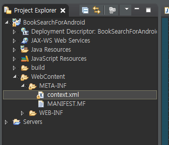

context,xml 파일 복사해주기

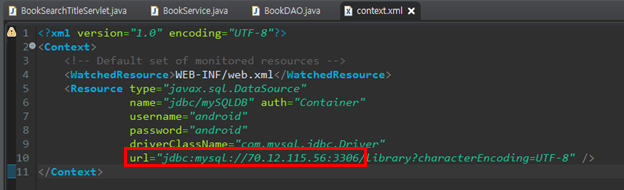

70.12.115.56 부분을 컴퓨터 해당 ip번호 바꿔주기


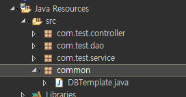

common 파일 복사 => database를 사용할 수 있게 끔 해주는 DBTemplate.java

**중요!! > 데이터베이스 구동시킨 상태에서 서버돌려야함**

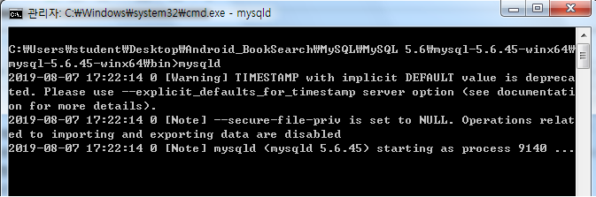

이상태에서 다른 cmd창열어서 mysql 하면됨

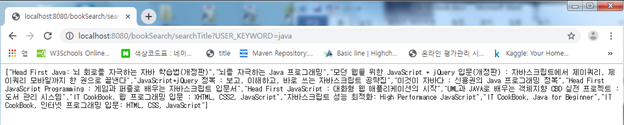

되는거 확인하고

안드로이드에서 JSON작업한거 읽어오는 작업할꺼임!!


---

3. Android에서 Java Network 기능 중 HTTP request 호출기능을 이용하여 Servlet 호출 후 JSON 받기

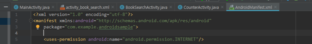

안드로이드에서 uses-permission은 외부접속에대한 접근을 풀어주기 위해서 

```xml
<!-- 인터넷 접속 -->
    <uses-permission android:name="android.permission.INTERNET" />
```

Manifest에서 추가해준다.


---

4. JSON 형태로 데이터를 받아온 후 데이터를 받아온 후 parsing 해서 ListView에 출력

Android에서 Project로 변경하고

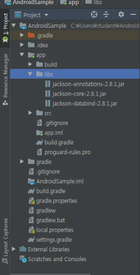

libs안에 jackson jar파일들을 파일들을 복붙 후

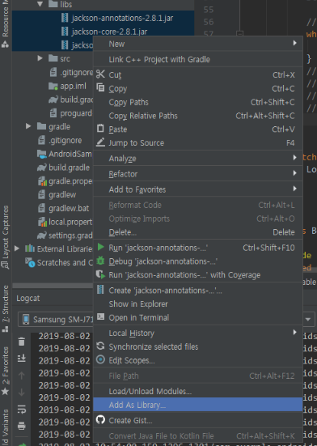

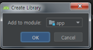

라이브러리 추가를 위해서 libs파일에서 마우스 우클릭 후 Add As Library를 눌러준다.

그러면 Create Library창이 뜨고 OK 버튼을 눌러주면 라이브러리가 추가된다. 라이브러리가 설치 된것을 확인하려면

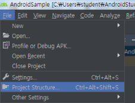

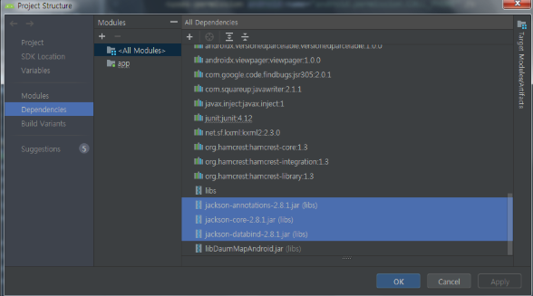

File - Project Structure - Dependencies 에서 확인이 가능함!!!


---

다시 Android로 돌아와서

도서검색을 위한 Activity 작성

**BookSearchActivity.java**

```java
package com.example.androidsample;

import androidx.annotation.NonNull;
import androidx.appcompat.app.AppCompatActivity;

import android.os.Bundle;
import android.os.Handler;
import android.os.Message;
import android.util.Log;
import android.view.View;
import android.widget.ArrayAdapter;
import android.widget.Button;
import android.widget.EditText;
import android.widget.ListView;

import com.fasterxml.jackson.databind.ObjectMapper;

import java.io.BufferedReader;
import java.io.InputStreamReader;
import java.net.HttpURLConnection;
import java.net.URL;

// Thread만들기      , 인터페이스를 뽑아낼수 있다
class SearchTitleRunnable implements Runnable {

    private String keyword;
    private Handler handler;

    SearchTitleRunnable(Handler handler, String keyword){
        this.handler = handler;
        this.keyword = keyword;
    }
    // => 이렇게하면 keyword 전달가능

    @Override
    public void run() {
        // keyword를 이용해서 web program에 접속한 후 결과를 받아온다!!
        // 결과로 받아온 JSON 문자열을 이용해서 ListView에 출력해야 한다!!
        // 외부THread이기떄문에 여기서는 ListView를 제어할 수 없다!!
        // 그래서 Handler를 이용해서 UI Thread에 ListView에 사용할 데이터를 넘긴다.

        // 네크워트 연결 , localhost를 사용하면 안되고 내가 접속할 실제 웹서버의 ip주소를 입력하면 된다.
        // String url = "http://localhost:8080/bookSearch/searchTitle?USER_KEYWORD=java";
        String url = "http://70.12.115.56:8080/bookSearch/searchTitle?USER_KEYWORD="+keyword;

        // 네트워크로 연결되는 것들은 반드시 예외처리를 해줘야함
        try {
            URL urlObj = new URL(url); // 주소를 자바 객체로 만들어줄꺼임 -> open connection 사용가능
            HttpURLConnection con = (HttpURLConnection)urlObj.openConnection();
            //연결객체를 만든 다음에 데이터를 읽어드릴수  있는 Stream(통로)을 뽑아낼수 있다.
            // network연결이 성공 한 후 데이터를 읽어들이기 위한 데이터 연결 통로 Stream을 생성한다.
            BufferedReader br = new BufferedReader(
                    new InputStreamReader(con.getInputStream())); // Stream을 더좋은걸로 바꿔주는거

            // 데이터 저장 용도로 만듬
            String input = "";
            StringBuffer sb = new StringBuffer();

            // 서버가 보내준 데이터를 읽어서 input에 넣는데 null이 아닐때까지 모두 읽으라는 의미
            while ((input = br.readLine()) != null){
                sb.append(input);
            }
            // Log창에 찍어보기
            // Log.i("DATA",sb.toString());

            // 얻어온 결과 JSON 문자열을 Jackson Library를 이용해서
            // Java 객체 형태(String[])로 변형해서 List에 입력할수 있게끔
            ObjectMapper mapper = new ObjectMapper();
            // Jackson Library를 이용하여 JSON문자열을 String[] 형태로 변환
            String[] resultArr = mapper.readValue(sb.toString(),String[].class); // 배열로 변환시켜주기.
            // 원래형태 <-> JSON

            // 데이터를 합치기 위해서 , 바구니라고 생각하면됨
            Bundle bundle = new Bundle();
            bundle.putStringArray("BOOKARRAY", resultArr); // key, value 쌍으로

            // 번들을 보내기 위해서는 메세지가 필요함
            Message msg = new Message();
            msg.setData(bundle);

            // 위에서 만든 메세지 객체를 보냄 , Activtiy에 있는 handler가 받음

            handler.sendMessage(msg);


        }catch (Exception e){
            Log.i("DATAerror",e.toString());
        }
    }
}

public class BookSearchActivity extends AppCompatActivity {

    @Override
    protected void onCreate(Bundle savedInstanceState) {
        super.onCreate(savedInstanceState);
        setContentView(R.layout.activity_book_search);

        Button searchBtn = (Button)findViewById(R.id.searchBookBtn);
        final EditText keywordEt= (EditText)findViewById(R.id.keywordEt);

        final ListView lv = (ListView)findViewById(R.id.lv);

        // handler만들면서 Override하면서 만들꺼임 , 이벤트에서 사용할 꺼니까 final 잡아야함
        final Handler handler = new Handler() {

            // handler에게 message가 전달되면 아래의 method가 callback되요!!
            @Override
            public void handleMessage(@NonNull Message msg) {
                super.handleMessage(msg);
                // 데이더 받음
                Bundle bundle = msg.getData();
                String[] result = bundle.getStringArray("BOOKARRAY");

                // adapter라는 객체는 데이터를 가져다가 view에 그리는 역할을 담당 ,
                // 배열에 있는데이터를 가져와서 그림
                ArrayAdapter adapter = new ArrayAdapter(BookSearchActivity.this,
                        android.R.layout.simple_list_item_1, result);
                // android.R.layout.simple_list_item_1 : 화면에 보여주는 형태가 정해져있다.

                // List 화면에 띄우기
                lv.setAdapter(adapter);
            }
        };

        // 웹서버에 접속해서 데이터를 받아온 후 해당 데이터를 ListView에 세팅
        // UI Thread(Activity Thread, Main Thread)에서는 Network연결을 할수 없다!!!

        searchBtn.setOnClickListener(new View.OnClickListener() {
            @Override
            public void onClick(View view) {
                // 사용자가 입력한 keyword를 가지고 Thread를 파생.                   인터페이스로 떨어짐ㄴ
                SearchTitleRunnable runnable = new SearchTitleRunnable(handler, keywordEt.getText().toString());
                // Thread를 만들려면 new Thread가 반드시 나와야함          외부 Thread에서 정의 해줘야함
                Thread t = new Thread(runnable);

                t.start();
            }
        });
```

**activity_book_search.xml**

```xml
<?xml version="1.0" encoding="utf-8"?>
<LinearLayout
    android:layout_width="match_parent"
    android:layout_height="match_parent"
    android:orientation="vertical"
    android:background="@color/activityBackground"
    xmlns:android="http://schemas.android.com/apk/res/android" >

    <LinearLayout
        android:layout_width="match_parent"
        android:layout_height="wrap_content"
        android:layout_gravity="center">

        <EditText
            android:layout_width="wrap_content"
            android:layout_height="wrap_content"
            android:layout_weight="1"
            android:id="@+id/keywordEt"/>
        <Button
            android:layout_width="wrap_content"
            android:layout_height="wrap_content"
            android:background="@color/btnbg"
            android:text="도서검색!"
            android:id="@+id/searchBookBtn"/>

    </LinearLayout>

    <ListView
        android:layout_width="match_parent"
        android:layout_height="wrap_content"
        android:id="@+id/lv"/>

</LinearLayout>
```


---

**오후 – 실습해보기 (영화정보 출력 및 세부정보 창 띄우기)**

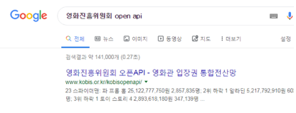

http://www.kobis.or.kr/kobisopenapi/webservice/rest/boxoffice/searchDailyBoxOfficeList.json?

Query String

key=430156241533f1d058c603178cc3ca0e&targetDt=20190801

key값은 회원가입을 하면 개인적으로 발급.

targetDt : 날짜

http://www.kobis.or.kr/kobisopenapi/webservice/rest/boxoffice/searchDailyBoxOfficeList.json?key=430156241533f1d058c603178cc3ca0e&targetDt=20190801

20190801날짜의 영화정보를 불러와서 보여줌

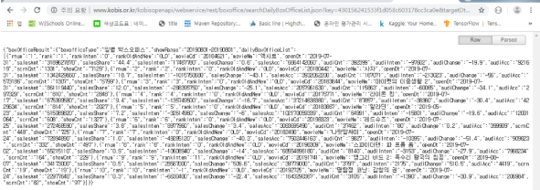

이런식으로 창에 띄워지는데 크롬에서 보기 편한 JSON형태로 보기 위해서 앱스토어에서 JSON FORMATTER를 설치해줌!!

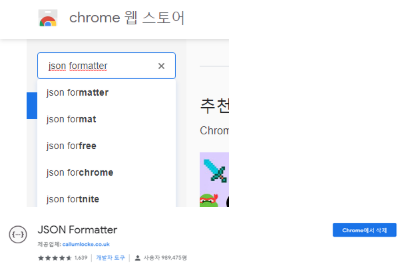

설치를 하면!!!

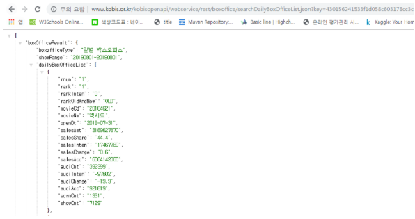

이런식으로 출력된다!!


날짜를 검색해서 해당 날짜에 대한 영화정보 띄우기

JSON 형태의 영화정보를 불러와서 ListView에서 보여주고 리스트 항목을 누르면 세부 정보 창이 뜨게 만들기


내가 발급 받은 발급키 : c20a460471ff1ffeb64baa5f1e11fec1

http://www.kobis.or.kr/kobisopenapi/webservice/rest/boxoffice/searchDailyBoxOfficeList.json?

key=c20a460471ff1ffeb64baa5f1e11fec1&targetDt=20190801