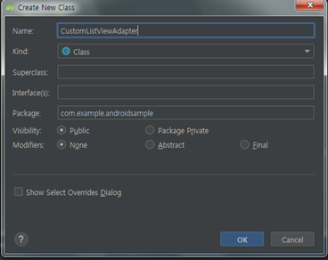

#### 2019-08-05 ( 6일차 )

# AndroidStudio

기존의 도서검색 프로그램은 데이터베이스로부터 검색된 도서명만 결과로 받아서 Android Activity 에 ListView로 단순출력

---

확장된 도서검색 프로그램은 데이터베이스로부터 키워드로 검색된 도서에 대한 도서 이미지, 도서제목, 도서저자, 도서 가격을 Android Activity 에 Custom ListView로 단순출력

이클립스 BookSearch_Workspace 들어가기

새로운 controller만들기 Servlet

default값으로!! 설정

get방식으로할꺼임!!

Dto(VO) 만들꺼임

BookService에 

getBooks에 마우스 가져다대면 새로 만든다는 작업클릭하면

자동생성이 된다.

VO 만들기

CustomListViewAdapter 만들기

