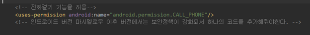

#### 2019-08-06 ( 7일차 )

# AndroidStudio

어제 CustomListView 작성

​	=> 도서 이미지도 같이 출력!! 작성

​		 이미지에 대한 데이터는 URL String => ( http://~~~~~ )

​		 이 이미지 링크에 접속해서 이미지 데이터를 가져와서 ImageView에 적용


---

Implicit Intent / 묵시적 인텐트

 

BookVO에


추가해준다.


manifest.xml


---

오후에!!

Implicit Intent 

1. 인텐트 필터의 중복 

2. 지도를 표현해 보아요!!!
    ( Google Map => KAKAO Map )

==> 검색서비스

새로운 프로젝트 만들꺼임!!! ImplicitTest


---

AndroidSample 프로젝트


https://developers.kakao.com/


개개인한테 할당된 key

key값이 있어야지 API이용가능


마켓 URL은 자동생성


사용자 관리 on으로 변경


저장한다.


---


AndroidManifest.xml에 <meta-data> 추가해줘야함 

위치정보 접근 permission 추가해주기

```xml
<meta-data
 android:name="com.kakao.sdk.AppKey"
 android:value="@string/kakao_app_key" /> // 이부분에 발급받은 key값 입력하면됨
```


keytool -exportcert -alias androiddebugkey -keystore C:\Users\student\.android\debug.keystore -storepass android -keypass android | openssl sha1 -binary | openssl base64


Opens니 설치해야함!!

https://www.openssl.org/

고급시스템설정 = 환경변수 들어가서 path에다가 C:\Users\student\Downloads\openssl-1.0.2s-x64_86-win64 붙여넣기


cmd창 껐다 키기

MAPTEST에서 


다운로드해서 압축해제하고


이 라이브러리를 


libs안에 포함시켜주고


해당 라이브러리 추가를 해주고


ok 해주면됨


이 파일들은 jniLibs 폴더 만들어서 복붙하기


---

3. 보안관련 Issue 처리 ( 전화 걸기 기능 ) => 복잡…


에러남 => 권한설정이 안되있어서 AndroidManifest에서 permission설정 해줘야함




---

박스오피스 순위 출력!!( 영화진흥위원회 API ) + 영화에 대한 한 줄 평( 다음영화에서 가져와서 )

