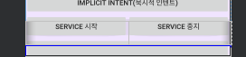
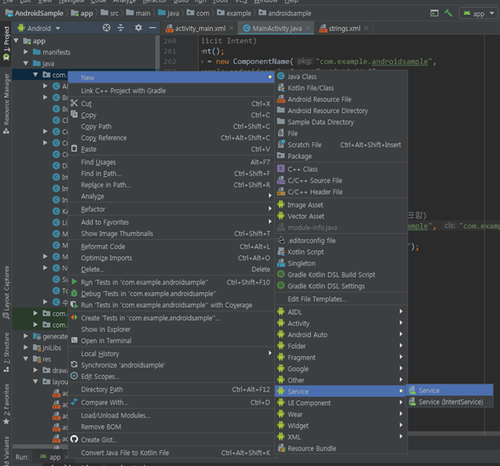
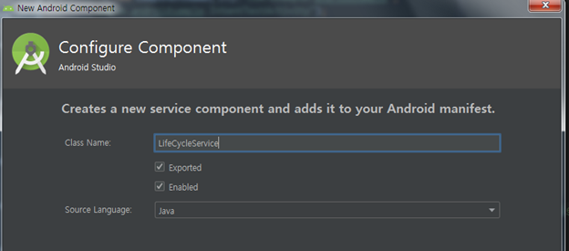

#### 2019-08-07 ( 8일차 )

# AndroidStudio

Android App 작성

KAKAO API를 이용하여 키워드를 이용한 도서검색

=> 결과를 JSON으로 받아서 Activity에 ListView등을 이용하여 결과를 출력 ( 얻어오는 데이터는 KAKAO API Reference 확인 )

Service를 이용하여 처리

Immortal Service는 Android 8.0 ( Oreo ) 버전부터 제약이 걸림.

---

**Service**

- 안드로이드를 구성하고 있는 4가지 component중 하나.

- Background 작업이 필요한 경우에 많이 사용한다.!!

- Activity의 가장 큰 관심거리(처리)는 사용자와의 Interaction

- Service는 사용자와의 Interaction은 없다.!!

  Activity를 위한 연산이나 특정 method를 제공

  Thread를 사용해서 처리

- Service의 lifecycle ( callback method ) 에 대해서 알아둬야 한다.

- Service의 주요한 callback method는 3개

  - onCreate() : 서비스 객체가 처음 생성될 때 호출

    ​					  사용할 리소스에 대한 초기화 작업

  - onStartCommand() : 실제 서비스가 일을 하기 위해서 호출되는 method

  - onDestroy() : 서비스 객체가 종료될 때 호출

    ​						사용하던 Thread를 중지, 리소스 해제

---

Main.xml에 버튼을 만든다.

**Enabled** : 서비스를 객체화 시킬껀지 / 항상 선택되어있어야함

**Exported** : 서비스를 다른 앱에서도 사용가능하게 할것인지 