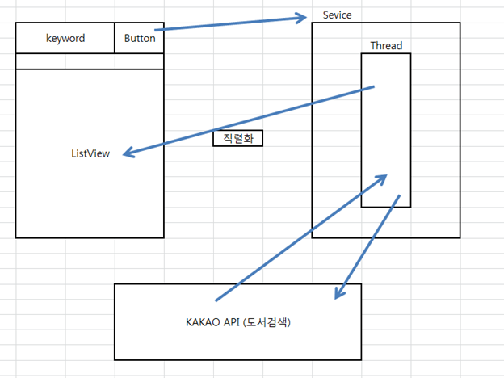
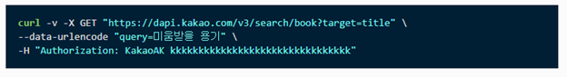
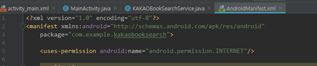
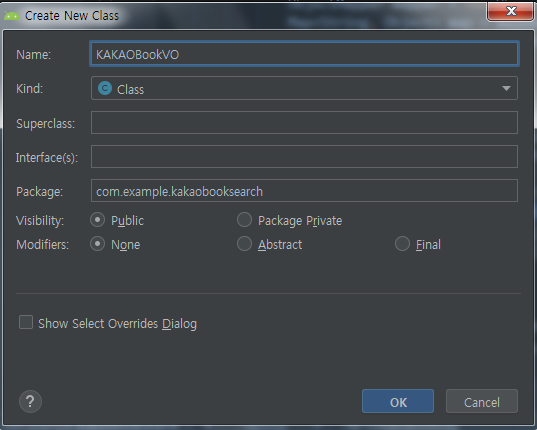

#### 2019-08-08 ( 9일차 )

# AndroidStudio

#### Broadcast Receiver

1. 안드로이드 시스템으로부터 나오는 신호(배터리 용량부족, 와이파이, USB케이블 연결/비연결)

2. 사용자 Application에서 발생시키는 임의의 신호

   - Broadcast Receiver는 Broadcast를 청취하는 component

   - Broadcast Receiver는 사용자와의 대면은 하지 않음

   - signal만 청취하는 component

---

새로운 Broadcast Receiver 만들기

Broadcast Receiver를 상속받아서 class가 하나 만들어진다.

onReceive()에서 처리해주면된다.

**AndroidManifest.xml**에서

이 부분추가해준다

긍데 안됨!! 7.0까지됨!!!

---

### 카카오 API 도서검색

**activity_main.xml**

 

onCreate(), onStartCommand(),onDestroy() 반드시 필요!!

앱을 하나 더 만들어준다.

REST API 키 필요

를 자바코드로 변경 해야 한다.

Manifest.xml에서 permission 추가해준다

Jackson library 추가

KAKAOBookVO에서

데이터 marshaling (마샬링)

