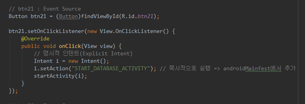

#### 2019-08-09 ( 10일차 )

# AndroidStudio

3번째 안드로이드 component인 Broadcast receiver


---

**Broadcast Message send (** **동적 )**

MainActivity.java 에 버튼을 추가해준다.


**activity_broadcast_test.xml**

```xml
<?xml version="1.0" encoding="utf-8"?>
<LinearLayout android:layout_height="match_parent"
    android:layout_width="match_parent"
    android:orientation="vertical"
    xmlns:android="http://schemas.android.com/apk/res/android" >

    <Button
        android:id="@+id/registerBtn"
        android:text="Broadcast Receiver 등록"
        android:layout_width="match_parent"
        android:layout_height="wrap_content" />

    <Button
        android:id="@+id/unregisterBtn"
        android:text="Broadcast Receiver 등록 해제"
        android:layout_width="match_parent"
        android:layout_height="wrap_content" />

    <Button
        android:id="@+id/sendSignalBtn"
        android:text="Broadcast 발생!!!!!!!!"
        android:layout_width="match_parent"
        android:layout_height="wrap_content" />

</LinearLayout>
```


**BroadcastTestActivity.java**

```java
package com.example.androidsample;

import androidx.appcompat.app.AppCompatActivity;
import androidx.core.app.NotificationCompat;

import android.app.NotificationChannel;
import android.app.NotificationManager;
import android.app.PendingIntent;
import android.content.BroadcastReceiver;
import android.content.Context;
import android.content.Intent;
import android.content.IntentFilter;
import android.graphics.BitmapFactory;
import android.media.RingtoneManager;
import android.os.Build;
import android.os.Bundle;
import android.view.View;
import android.widget.Button;
import android.widget.Toast;

public class BroadcastTestActivity extends AppCompatActivity {

    // Activity의 field로 BroadcastReceiver 지정
    private BroadcastReceiver receiver;

    @Override
    protected void onCreate(Bundle savedInstanceState) {
        super.onCreate(savedInstanceState);
        setContentView(R.layout.activity_broadcast_test);

        Button registerBtn = (Button)findViewById(R.id.registerBtn);

        registerBtn.setOnClickListener(new View.OnClickListener() {
            @Override
            public void onClick(View view) {
                // Broadcast Receiver를 생성.
                // 먼저 Broadcast Receiver가 어떤 Broadcast를 청취할 수 있는지를
                // 나타내는 intent filter를 생성.
                IntentFilter filter = new IntentFilter();
                filter.addAction("MY_BROADCAST"); // Broadcast에 해당하는 action을 하나잡는다. 이걸 가지고 receiver를 생성
                // 안드로이드 시스템에서 나오는 여러가지 정해져있는 Broadcast를 catch할 수 있다.!

                // BroadcastReceiver() : 추상메서드이기때문에 inner class 만들어서 오버라이딩하면서 만듬
                // 직접객체를 만들수 없기 때문에 오버라이딩하는거임!!
                // 안드로이드의 3번째 component인 Broadcast receiver를 생성
                receiver = new BroadcastReceiver() {
                    @Override
                    public void onReceive(Context context, Intent intent) {
                        // broadcast를 잡았을때 처리해야 할 코드 작성
                        // Toast.makeText(context,"신호 캐치!!",Toast.LENGTH_SHORT).show();

                        // Notification을 사용해 보아요!!

                        // NotificationManager 객체를 획득
                        NotificationManager nManager = (NotificationManager)context.getSystemService(Context.NOTIFICATION_SERVICE);

                        // channelID와  channelName, Notification 중요도 설정
                        String channelID = "NY_CHANNEL";
                        String channelName = "MY_CHANEL_NAME";
                        int important = NotificationManager.IMPORTANCE_HIGH; // 중요한 Notification라는 것을 알려줌

                        // Oreo 버전이상에서는 channel 객체를 생성해서 설정해야 된다. if문으로 버전체크!
                        // Build.VERSION.SDK_INT: 버전SDK숫자 , Build.VERSION_CODES.O : 오레오버전의미
                        if (Build.VERSION.SDK_INT >= Build.VERSION_CODES.O){
                            NotificationChannel channel = new NotificationChannel(channelID,channelName,important);
                            // 채널 설정 ,NotificationChannel(3개의 인자)
                            nManager.createNotificationChannel(channel); // 채널 생성
                        }

                        // 실제 화면에 보이는 Notification을 생성  , 빌더(builder - Notification을 생성하기위해 필요) 생성
                        NotificationCompat.Builder builder = new NotificationCompat.Builder(context,channelID);

                        // Intent를 하나 생성 => 나중에 notification을 클릭했을 때
                        // 화면에 Activity를 보여주기 위한 용도
                        Intent nIntent = new Intent(context,BroadcastTestActivity.class);
                        nIntent.addFlags(Intent.FLAG_ACTIVITY_CLEAR_TOP);
                        nIntent.addFlags(Intent.FLAG_ACTIVITY_SINGLE_TOP);

                        int requestID = 10; // 해당 intent의 아이디를 나중에 받기 위해서

                        // PendingIntent는 intent를 가지고 있는 Intent
                        // Intent의 수행을 지연시키는 역할을 수행!!
                        PendingIntent pIntent = PendingIntent.getActivity(context,requestID,nIntent,PendingIntent.FLAG_UPDATE_CURRENT);

                        // Notification 설정부분
                        builder.setContentTitle("제목부분이에요!!")
                                .setContentText("여기는 내용이 나와요!!")
                                .setAutoCancel(true) // 터치했을때 사라지도록 처리
                                .setSound(RingtoneManager.getDefaultUri(RingtoneManager.TYPE_NOTIFICATION)) // 시스템이 기본으로 가지는 소리 설정
                                .setSmallIcon(android.R.drawable.btn_star) // 별모양의 아이콘 표시
                                .setLargeIcon(BitmapFactory.decodeResource(getResources(),R.drawable.cat1)) // 이미지를 비트맵형태로 변경
                                .setContentIntent(pIntent);

                        // Notification 만들고 매니저를 이용해서 실제 화면에 띄우는 부분
                        // NotificationManager를 통해서 실제 Notification 실행
                        nManager.notify(0, builder.build());
                    }
                };

                // receiver를 등록하는 작업 (리시버가 등록되어야지 신호를 잡을수 있다.!!)
                registerReceiver(receiver,filter); // 해당 receiver와 filter가 결합되서 등록

            }
        });

        // 등록을 해지해주는 버튼
        Button unregisterBtn  = (Button)findViewById(R.id.unregisterBtn);

        unregisterBtn.setOnClickListener(new View.OnClickListener() {
            @Override
            public void onClick(View view) {
                // 버튼이 클릭되면 receiver의 등록을 해제해 줘요!!
                unregisterReceiver(receiver);

                // 현재 등록이 되어있는지를 확인한 후 등록되어 있는 경우에만 해제.
                if( receiver != null ){
                    unregisterReceiver(receiver);
                }
            }
        });

        Button sendSignalBtn = (Button)findViewById(R.id.sendSignalBtn);
        sendSignalBtn.setOnClickListener(new View.OnClickListener() {
            @Override
            public void onClick(View view) {
                Intent i = new Intent();
                i.setAction("MY_BROADCAST");
                sendBroadcast(i);
            }
        });
    }
}
```


---

**오후**

4번째 안드로이드 Component

=> Content Provider ( 데이터를 제공할 때 사용 )

​	 Content Resolver ( 제공된 데이터를 사용할 때 사용 )

우리의 안드로이드 앱은 sanbox model을 기반으로 동작.

하나의 앱에서 생성한 데이터는 해당 앱에 종속되고 다른 앱에서 사용할 수 없다.

우리가 앱을 만들어서 주소록에서 데이터를 가져와서 이용하려고 한다.

사용자가 만드는 App은 일반적으로 Content Provider를 만들지 않는다.!


---

안드로이드 앱은 데이터를 관리하는 방법이 몇가지 있는데 일반적으로 File처리와 Database처리를 한다.

안드로이드 시스템 내부에 있는 SQLite라는 소형 데이터베이스를 이용해서 처리.

 

어떻게 SQLite를 이용하는건가요??

이렇게 만든 데이터베이스를 외부에 제공하려면 어떻게 해야 하는가?

다른 앱에 가지고 있는 데이터베이스에 접근하려면 어떻게 해야 하는가?


---

**SQLite Sample Activity**

MainActivity.java 에 버튼을 추가해준다.




**activity_database_sample.xml**

```xml
<?xml version="1.0" encoding="utf-8"?>
<LinearLayout
    android:layout_width="match_parent"
    android:layout_height="match_parent"
    android:orientation="vertical"
    xmlns:android="http://schemas.android.com/apk/res/android">

    <Button
        android:layout_width="match_parent"
        android:layout_height="wrap_content"
        android:text="데이터베이스 생성(데이터입력)"
        android:id="@+id/createDbBtn"/>

    <Button
        android:layout_width="match_parent"
        android:layout_height="wrap_content"
        android:text="데이터베이스 select"
        android:id="@+id/selectDbBtn"/>

    <TextView
        android:layout_width="match_parent"
        android:layout_height="wrap_content"
        android:id="@+id/selectTv"/>

</LinearLayout>
```


**DatabaseSampleActivity.java**

```java
package com.example.androidsample;

import androidx.appcompat.app.AppCompatActivity;

import android.database.Cursor;
import android.database.sqlite.SQLiteDatabase;
import android.os.Bundle;
import android.util.Log;
import android.view.View;
import android.widget.Button;
import android.widget.TextView;

public class DatabaseSampleActivity extends AppCompatActivity {

    private SQLiteDatabase db;

    @Override
    protected void onCreate(Bundle savedInstanceState) {
        super.onCreate(savedInstanceState);
        setContentView(R.layout.activity_database_sample);

        Button createDbBtn = (Button)findViewById(R.id.createDbBtn);
        createDbBtn.setOnClickListener(new View.OnClickListener() {
            @Override
            public void onClick(View view) {
                // 클릭하면 Database를 생성하고 Table을 만든다!!
                // sqlite Database를 사용하기 쉽도록 도와주는 Helper class가 제공.
                // 이 Helper class를 직접이용하는게 아니라 이놈을 상속받아서
                // 클래스를 작성한 후 사용자 정의 클래스의 객체를 이용.
                // Helper class를 작성하러 갑시다!!
                MySqliteHelper helper = new MySqliteHelper(DatabaseSampleActivity.this);
                //helper를 통해서 database에 대한 Handle을 얻어 올 수 있다.
                db = helper.getWritableDatabase(); // 액티비티의 필드로 올림
            }
        });

        Button selectDbBtn = (Button)findViewById(R.id.selectDbBtn);

        selectDbBtn.setOnClickListener(new View.OnClickListener() {
            @Override
            public void onClick(View view) {
                // Database handle을 이용해서 Database 처리를 할 수 있다.
                // rawQuery() : select 계열의 SQL문을 실행할 때 사용된다.!
                // Cursor : Cursor의 역할은 JDBC의 ResultSet의 역할을 수행
                Cursor c = db.rawQuery("SELECT * FROM member ", null);
                String result = "" ;
                while (c.moveToNext()){ // moveToNext() :  rs.next()와 같은역할
                    result += c.getString(0);
                    result += ", ";
                    result += c.getInt(1);
                    result += "\n";
                }
                // 이렇게 데이터를 다 얻어오면 해당 결과를 TextView에 출력
                TextView tv = (TextView)findViewById(R.id.selectTv);
                tv.setText(result);

            }
        });
    }
}
```


**MySqliteHelper.java**

```java
package com.example.androidsample;

import android.content.Context;
import android.database.sqlite.SQLiteDatabase;
import android.database.sqlite.SQLiteOpenHelper;
import android.util.Log;

public class MySqliteHelper extends SQLiteOpenHelper {
    // SQLiteOpenHelper를 상속받아서 사용 => 오버라이딩(재정의)해야함

    // 생성자도 다시 작성해 줘야한다!! 기본생성자가 아닌 인자를 가지는 생성자여만한다.
    public MySqliteHelper(Context context){
        // 상위 클래스의 생성자 호출(인자 4개짜리 생성자 호출)
        super(context,"Member.db",null,1); // 인자 4개 생성자호출
    }

    @Override
    public void onCreate(SQLiteDatabase sqLiteDatabase) {
        // 일반적으로 초기 데이터베이스 세팅코드가 들어간다.
        // 테이블을 생성하고 초기데이터를 insert하는 작업.
        // execSQL() : resultset을 가져오지 않는 SQL구문을 실행.

        sqLiteDatabase.execSQL("CREATE TABLE IF NOT EXISTS member (userName Text, userAge INTEGER);");

        sqLiteDatabase.execSQL("INSERT INTO member VALUES('홍길동',30);");
        sqLiteDatabase.execSQL("INSERT INTO member VALUES('최길동',10);");
        sqLiteDatabase.execSQL("INSERT INTO member VALUES('박길동',50);");

        Log.i("DatabaseExam", "Helper의 onCreate() 호출!!");

    }

    @Override
    public void onUpgrade(SQLiteDatabase sqLiteDatabase, int i, int i1) {

    }
}
```


---

SQL 구문

CREATE TABLE IF NOT EXISTS member (userName Text, userAge INTEGER);

sqLiteDatabase.execSQL("INSERT INTO member VALUES('홍길동',30);");

sqLiteDatabase.execSQL("INSERT INTO member VALUES('최길동',10);");

sqLiteDatabase.execSQL("INSERT INTO member VALUES('박길동',50);");


**MyContentProvider.java**

```java
package com.example.androidsample;

import android.content.ContentProvider;
import android.content.ContentValues;
import android.database.Cursor;
import android.database.sqlite.SQLiteDatabase;
import android.net.Uri;
import android.util.Log;

public class MyContentProvider extends ContentProvider {

    // 필드지정
    private SQLiteDatabase db;

    public MyContentProvider() {
    }

    @Override
    public int delete(Uri uri, String selection, String[] selectionArgs) {
        // Implement this to handle requests to delete one or more rows.
        throw new UnsupportedOperationException("Not yet implemented");
    }

    @Override
    public String getType(Uri uri) {
        // TODO: Implement this to handle requests for the MIME type of the data
        // at the given URI.
        throw new UnsupportedOperationException("Not yet implemented");
    }

    @Override
    public Uri insert(Uri uri, ContentValues values) {
        // TODO: Implement this to handle requests to insert a new row.
        throw new UnsupportedOperationException("Not yet implemented");
    }

    @Override
    public boolean onCreate() {
        MySqliteHelper helper = new MySqliteHelper(getContext());
        db = helper.getWritableDatabase();
        Log.i("DatabaseExam", "CP(ContentProvider)에 onCreate() 호출!!");
        return true;
    }

    @Override
    public Cursor query(Uri uri, String[] projection, String selection,
                        String[] selectionArgs, String sortOrder) {
        // select 계열의 SQL문이 실행되고 그결과를 Cursor를 다른 App에 제공.
        Log.i("DatabaseExam", "CP(ContentProvider)에 query() 호출 되었어요!!");
        // 인자로 들어오는 값을 이용하여 사용할 SQL을 구성해야 한다.!!
        String sql = "SELECT * FROM member";
        return db.rawQuery(sql,null);

    }

    @Override
    public int update(Uri uri, ContentValues values, String selection,
                      String[] selectionArgs) {
        // TODO: Implement this to handle requests to update one or more rows.
        throw new UnsupportedOperationException("Not yet implemented");
    }
}
```


---

**새로운 프로젝트 생성**


---

**주소록 가져오기**

MainActivity.java 에 버튼을 추가해준다.


AndroidManifest.xml 에서 보안설정 해제 퍼미션을 추가해준다.


